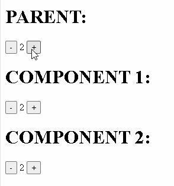

# svelte-runes-store

    [](https://twitter.com/joaquimnetocel)

svelte-runes-store is a svelte/sveltekit package to build (persistent) svelte stores using runes.



## VERSIONS

- WORKS WITH SVELTE 5 ONLY.

## FEATURES

- USES THE SVELTE 5 RUNES.
- PERSISTENT AND NON PERSISTENT STORES.
- TYPESCRIPT SUPPORT.

## DEMOS

- [REPL: BASIC EXAMPLE](https://svelte-5-preview.vercel.app/#H4sIAAAAAAAACu2SQWuDQBCF_8qyFxOisXo0KgTJsUlIc6s9GF0bqc7KOgaK-N_LupLaRtoUcio5LTO7b-bx9mtomuWsos5zQyEqGHXosiypTvG9lEV1YjkyqtOK1yKWHbeKRVYiySN49UKKVUj9EELMipILJA1Ja4gx4xAIFiF7Qi4YaUkqeEE0Nc4QNbDKqOSVthiIA16UHBig1b-fm5-tuRKPC-xLgT0UQIgxhwpJtzTgNSATxBszO2nk6xBPUV4zhzzoqpTpOESTRy_Xupt2ugjBNVUqMglwj5a_Xe5W673jmkdL9ZLs1MXkHmpEDmomhzjP4jevmUyJ55N-cYhDk_POB_HISNMg1kJp2laeviqMbpGpNnW95lLcqlRu6mc27mf2zY9r9mmAO_hx0x_WdldTnRY8ydKMJdRBUbNWP3P6Kb0JrjsWJVfB-htK50Eu1MWBCX_yBZpRXILN43azXq33xLoz8yMzVxFh_yci7DsRfyTipf0A3BEhrNcGAAA=)
- [REPL: TYPED EXAMPLE](https://svelte-5-preview.vercel.app/#H4sIAAAAAAAACu2STW-CQBCG_8pkL2oKUjgikBjjsWra3koPiGslhVmyO5g0hP_eLGsqVtLYxDQ9eAAyM7zvfOSp2TbLuWL-S80wKTjz2bQsmcXoo9SB2vOcOLOYEpVMdSZQqcxKgjzBtzBmpGIWxRhTVpRCEtSwrTClTOBM8oT4EwnJoYGtFAUMjJ0tK-TKVro0mHTEM1GUAjmSe_h_7BxTYyPuF3jnAq8rwJj0RqBfi6TgCkIY6IVnokLi0rjqJxWoCNrZDjUI-3YKsCrWXFpHy2hYtya0T_KK-3BvmVC38U-7tZVmNIkxcMw99Q0x2LnRavo4Xzz7gbNzTW6T7dsDB-uKSKDxFJjmWfoe1sMRhBEcGsfUnXvczgEh9CRtcM3G1DT6G5nAbhs5plObq8_FjbnnVee565_n7ts8gXO4BgYdVpyoG3ttzCxWiE22zfiG-SQr3lhfhB-lVwH9kSebyzC_FoZfHfsgPPHrRWy2fFgtF_PFM7g3zn7k7CKKvH9J0Z8x5N0Y-iVDr80nYmHMYHcHAAA=)

## INSTALLATION

```bash
npm install svelte-runes-store
```

## EXAMPLES

To run the examples from `/src/routes`:

```bash
git clone https://github.com/joaquimnetocel/svelte-runes-store.git
cd svelte-runes-store
npm install
npm run dev
```

## COMPONENT STRUCTURE

- `functionCreateStore`: Function to create the store.
- `functionReadStore`: Function to read the store.

## PARAMETERS

- PROPS OF `functionCreateStore`:

| PARAMETER    | DESCRIPTION                 | TYPE                               | REQUIRED | DEFAULT        |
| ------------ | --------------------------- | ---------------------------------- | -------- | -------------- |
| `value`      | INITIAL VALUE OF THE STORE. | `Generic`                          | YES      | -              |
| `name`       | STORE NAME.                 | `string`                           | YES      | -              |
| `persistent` | PERSISTENT STORE (OR NOT).  | `boolean`                          | NO       | `false`        |
| `storage`    | STORAGE TYPE.               | `localStorage` OR `sessionStorage` | NO       | `localStorage` |

- PROPS OF `functionReadStore`:

| PARAMETER | DESCRIPTION | TYPE     | REQUIRED | DEFAULT |
| --------- | ----------- | -------- | -------- | ------- |
| `name`    | STORE NAME. | `string` | YES      | -       |
