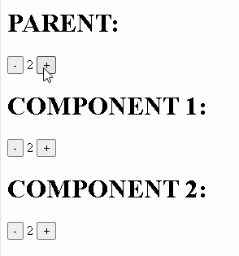

# svelte-runes-store

    [](https://twitter.com/joaquimnetocel)

svelte-runes-store is a svelte package to build (persistent) svelte states that can be shared among components through the context.



## VERSIONS

- WORKS WITH SVELTE 5 AND SVELTEKIT.

## FEATURES

- USES THE SVELTE 5 RUNES.
- PERSISTENT AND NON-PERSISTENT STORES.
- TYPESCRIPT SUPPORT.
- ADDS STORES TO THE CONTEXT, AVOIDING STATE SHARING IN SSR.

## INSTALLATION

```bash
npm install svelte-runes-store
```

## EXAMPLES

To run the examples from `/src/routes`:

```bash
git clone https://github.com/joaquimnetocel/svelte-runes-store.git
cd svelte-runes-store
npm install
npm run dev
```

## COMPONENT STRUCTURE

- `store.create`: Function to create the store.
- `store.read`: Function to read the store.

## PARAMETERS

- PARAMETERS OF `store.create`:

| PARAMETER | DESCRIPTION                 | TYPE                               | REQUIRED | DEFAULT        |
| --------- | --------------------------- | ---------------------------------- | -------- | -------------- |
| `value`   | INITIAL VALUE OF THE STORE. | `Generic`                          | YES      | -              |
| `key`     | CONTEXT KEY.                | `string`                           | YES      | -              |
| `storage` | STORAGE TYPE.               | `localStorage` OR `sessionStorage` | NO       | `localStorage` |

- PARAMETERS OF `store.read`:

| PARAMETER | DESCRIPTION  | TYPE     | REQUIRED | DEFAULT |
| --------- | ------------ | -------- | -------- | ------- |
| `key`     | CONTEXT KEY. | `string` | YES      | -       |
